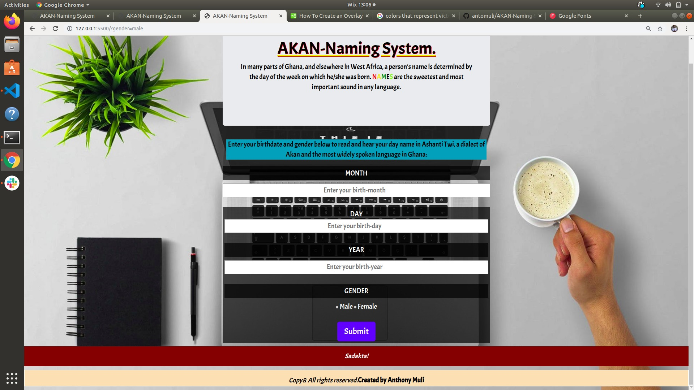
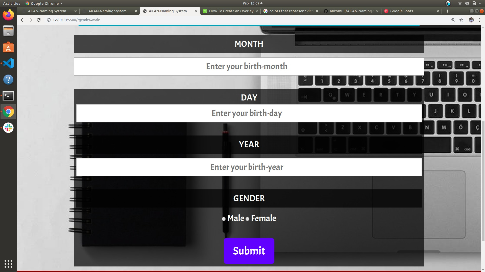

# Project Name.
AKAN-Naming System

## Author's Details.
Name: Anthony Muli

Email: mulianthony561@gmail.com

FB: Anto De Sparta Neyo.

Tel:0796577998.

### Project Description.
Proper names are poetry in the raw. Like all poetry they are untaranslatable.

#### Project-Setup Instructions.
1.Open your *github* account.

2.Search for the github username:**antomuli**.

3.In antomuli's repositories,git clone the AKAN-Naming System repository into your you *-local repository-* which is your machine(computer) /git clone the following link:***https://github.com/antomuli/AKAN-Naming-System.git***

***BDD***
## project screenshot
Akan system of giving names to their children is very unique. Unlike the Europeans, each child is given his/her own first and sur - names irrespective of the surname of the father. The first names are always derived from the day a child was born.
The image below is the overview of the application where an individual is requested to enter his/her birth credentials:

Curious! Curiosity has its own reason for exciting..Find out what's yours!

The form to be filled looks like the one above.

The beginning of wisdom is to call things by their right names...For now;according to the day of the week. Some of the names are indicated below:

**MALE NAMES**                                            
1.Sunday- Kwasi.                                                            

2.Monday- Kwadwo.                                          

3.Tuesday- Kwabena.                                        

4.Wednesday- Kwaku.                                        

5.Thursday- Yaw.                                           

6.Friday- Kofi.                                            

7.Saturday- Kwame.                                         

**FEMALE NAMES**

1.Sunday: Akosua

2.Monday: Adwoa

3.Tuesday: Abenaa

4.Wednesday: Akua

5.Thursday: Yaa

6.Friday: Afua

7.Saturday: Ama

##### Live Link to AKAN-Naming System.
The following is the live link to the project "AKAN-Naming System":
This site was built using github pages:
https://antomuli.github.io/AKAN-Naming-System/

**The following include the list of technologies used:
1.html.5

2.CSS.

3.Bootsrap Version 4.3.1

4.Javascript.

5.JQuery.

***Known Bugs***

1.Unless the page is reloaded it will be undefined in the footer. Instead of having the word **sadakta** which means congaratulation you will see the word *undefined*.

2.Dates may not be up to the expected level.

###### LICENSE AND COPY RIGHT INFO.
MIT License

Copyright (c) 2019 Moringa School-Anto

Permission is hereby granted, free of charge, to any person obtaining a copy of this software and associated documentation files (the "Software"), 
to deal in the Software without restriction, including without limitation the rights to use, copy, modify, merge, publish, distribute, sublicense, 
and/or sell copies of the Software, and to permit persons to whom the Software is furnished to do so, subject to the following conditions:

The above copyright notice and this permission notice shall be included in all copies or substantial portions of the Software.

THE SOFTWARE IS PROVIDED "AS IS", WITHOUT WARRANTY OF ANY KIND, EXPRESS OR IMPLIED, INCLUDING BUT NOT LIMITED TO THE WARRANTIES OF MERCHANTABILITY, 
FITNESS FOR A PARTICULAR PURPOSE AND NONINFRINGEMENT. IN NO EVENT SHALL THE AUTHORS OR COPYRIGHT HOLDERS BE LIABLE FOR ANY CLAIM, DAMAGES OR OTHER LIABILITY, 
WHETHER IN AN ACTION OF CONTRACT, TORT OR OTHERWISE, ARISING FROM, OUT OF OR IN CONNECTION WITH THE SOFTWARE OR THE USE OR OTHER DEALINGS IN THE SOFTWARE.

